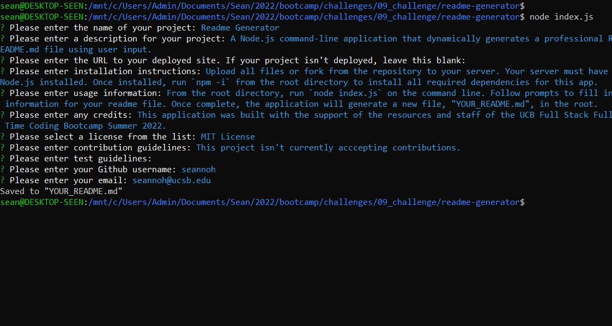

# Readme Generator

[](#license)

A Node.js command-line application that dynamically generates a professional README.md file using user input.

## Description 

This application generates a readme file based on user input. The user is prompted with several questions to fill the content of the readme. This app is built using JavaScript running in the Node.js environment. The inquirer package is used to handle the command-line interface

## Technologies Used
- JavaScript
- [Node.js](https://nodejs.org/)
- [Inquirer.js](https://www.npmjs.com/package/inquirer)

## Table of Contents

* [Installation](#installation)
* [Usage](#usage)
* [Credits](#credits)
* [License](#license)
* [Contributing](#contributing)


## Installation
Upload all files or fork from the repository to your server. Your server must have Node.js installed. Once installed, run `npm -i` from the root directory to install all required dependencies for this app.

## Usage 
From the root directory, run `node index.js` on the command line. Follow prompts to fill in information for your readme file. Once complete, the application will generate a new file, "YOUR_README.md", in the root.



## Credits
This application was built with the support of the resources and staff of the UCB Full Stack Full Time Coding Bootcamp Summer 2022. 

### References
- https://shields.io/category/license
- https://www.npmjs.com/package/inquirer#documentation
- https://choosealicense.com/

## License
<details>
  <summary><b>MIT License</b></summary>

```
MIT License

Copyright (c) 2022 seannoh

Permission is hereby granted, free of charge, to any person obtaining a copy
of this software and associated documentation files (the "Software"), to deal
in the Software without restriction, including without limitation the rights
to use, copy, modify, merge, publish, distribute, sublicense, and/or sell
copies of the Software, and to permit persons to whom the Software is
furnished to do so, subject to the following conditions:

The above copyright notice and this permission notice shall be included in all
copies or substantial portions of the Software.

THE SOFTWARE IS PROVIDED "AS IS", WITHOUT WARRANTY OF ANY KIND, EXPRESS OR
IMPLIED, INCLUDING BUT NOT LIMITED TO THE WARRANTIES OF MERCHANTABILITY,
FITNESS FOR A PARTICULAR PURPOSE AND NONINFRINGEMENT. IN NO EVENT SHALL THE
AUTHORS OR COPYRIGHT HOLDERS BE LIABLE FOR ANY CLAIM, DAMAGES OR OTHER
LIABILITY, WHETHER IN AN ACTION OF CONTRACT, TORT OR OTHERWISE, ARISING FROM,
OUT OF OR IN CONNECTION WITH THE SOFTWARE OR THE USE OR OTHER DEALINGS IN THE
SOFTWARE.
```
      
</details>

## Contributing
This project isn't currently acccepting contributions.


## Questions
- View my Github [profile](https://github.com/seannoh)
- Contact me at my [email](https://github.com/seannoh@ucsb.edu)


